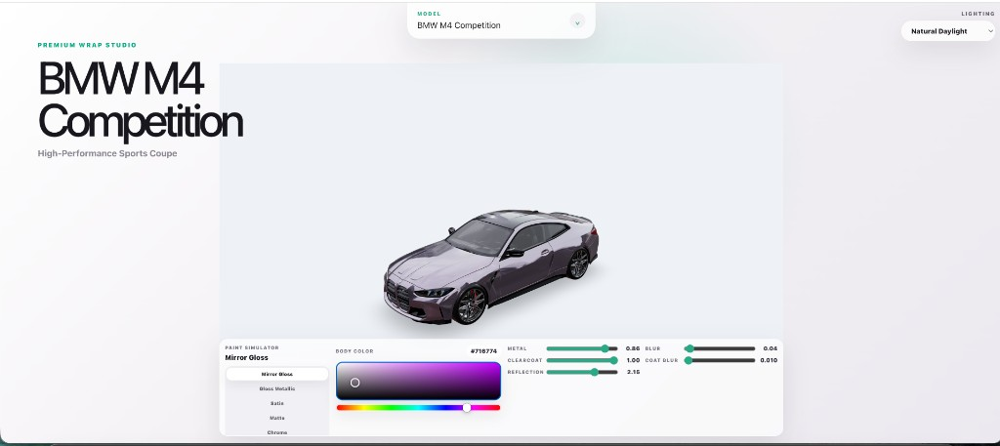
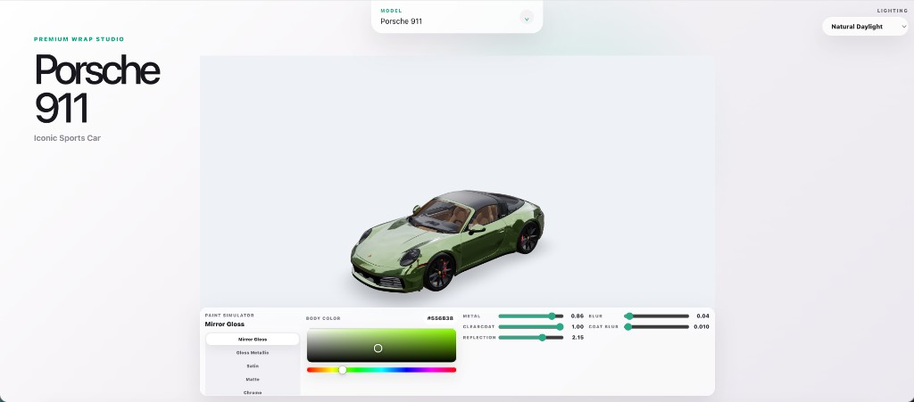

# Car Configurator

A **premium 3D car configurator** web app: load high-quality GLB models, orbit the vehicle in a bright showroom-style scene, switch lighting, and tune paint in real time with finish presets, a color picker, and material sliders.

Built with **React**, **Vite**, **Three.js**, **React Three Fiber**, **@react-three/drei**, and **Tailwind CSS**.

---

## Screenshots

**BMW M4 Competition** — metallic wrap, Natural Daylight, bottom **Paint Simulator** with finish list, saturation/brightness + hue controls, and PBR sliders (metal, clearcoat, reflection, blur, coat blur).



**Porsche 911** — same layout: model and lighting dropdowns, hero copy, 3D viewer with contact shadow, and full paint controls.



---

## Features

- **3D viewer** — Orbit controls, grounded contact shadows, studio-style background.
- **Models** — Dropdown to switch vehicles (paths defined in `src/assets/data.jsx`); GLBs under `src/components/models/` (bundled) or `public/models/` depending on setup.
- **Lighting** — Presets such as Natural Daylight, showroom, and studio-style rigs.
- **Paint simulator** — Finish presets (e.g. Mirror Gloss, Gloss Metallic, Satin, Matte, Chrome), hex-based color area + hue strip, and sliders for metalness, clearcoat, reflection strength, roughness/blur, and clearcoat roughness.
- **Performance** — Sensible DPR cap and a single shared body material pipeline for smooth updates.

---

## Getting started

```bash
npm install
npm run dev
```

Open the URL Vite prints (usually `http://localhost:5173`).

```bash
npm run build   # production build
npm run lint    # ESLint
```

---

## Project layout

See [`docs/PROJECT_STRUCTURE.md`](./docs/PROJECT_STRUCTURE.md) for file-level responsibilities and the full directory map.

---

## License

Private project (`"private": true` in `package.json`). Adjust as needed for your distribution.
